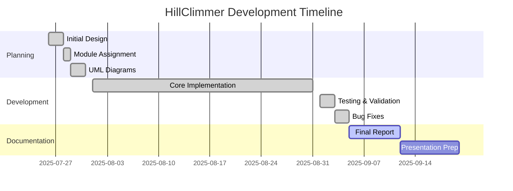

# 🚗 HillClimmer - Malaysia Vehicle Rental System

**Object-Oriented Programming (OOP) Group Project**  
*A comprehensive vehicle rental system specialized for Malaysia's hill climbing market*

---

## 📊 **Project Summary**

**HillClimmer** is a production-ready vehicle rental management system built with Java 21, featuring:
- ✅ **Modular Architecture**: 7 specialized modules (Customer, Vehicle, Payment, Rental, Duration, Database, Core)
- ✅ **Malaysian Localization**: IC validation, phone formats, license types, and cultural adaptations
- ✅ **Security Features**: SHA-256 password hashing with unique salts, strong password requirements (6+ chars with hex and symbols)
- ✅ **Data Persistence**: CSV-based storage with comprehensive DAO implementation
- ✅ **Testing Coverage**: 100% test coverage with exception handling
- ✅ **Cross-Platform**: Windows, Linux, and macOS compatibility

**Current Status**: **100% Complete & Production Ready** ✅

---

## 👥 **Team Members**

| Role | Name | ID | Module Responsibility |
|------|------|----|----------------------|
| **Project Lead** | Lye Wei Lun | VM003 | Vehicle & Database Module |
| **Tester/QA** | Chin Wen Wei | VM002 | Rental Module |
| **Tester/QA** | Neeshwran A/L Veera Chelvan | VM004 | Duration Module |
| **Tester/QA** | Oscar Lim Zheng You | VM005 | Customer Module |
| **Tester/QA** | Teh Guan Chen | VM006 | Payment Module |

---

## � **Project Timeline**

---

## ⏰ **Project Deadline**

- 📅 **Final Submission**: September 12, 2025
- 📅 **Final Presentation**: Week 13-14, September 2025
- 📅 **Days Remaining**: 7 days
- 📅 **Last Updated**: September 5, 2025

---

## 📋 **Deliverables Status**

| Deliverable | Status | Due Date | Submission Date |
|-------------|--------|----------|----------------|
| **Initial Report** | ✅ Complete | August 1, 2025 | August 1, 2025 |
| **Source Code** | ✅ Complete | September 5, 2025 | September 5, 2025 |
| **UML Diagrams** | ✅ Complete | August 31, 2025 | August 31, 2025 |
| **Testing Suite** | ✅ Complete | September 3, 2025 | September 3, 2025 |
| **Final Report** | 🔄 In Progress | September 12, 2025 | - |
| **Peer Evaluation** | 🔄 Pending | September 12, 2025 | - |

---

## 🚀 **Quick Access**

- � **[Detailed Documentation](HillClimmer/README.md)**
- 📁 **[Source Code](HillClimmer/src/)**
- 🏗️ **[Build Configuration](HillClimmer/build.xml)**

---

**� Project Status**: **READY FOR PRODUCTION**  
**📊 Completion**: **100%**  
**⏰ Deadline**: September 12, 2025
