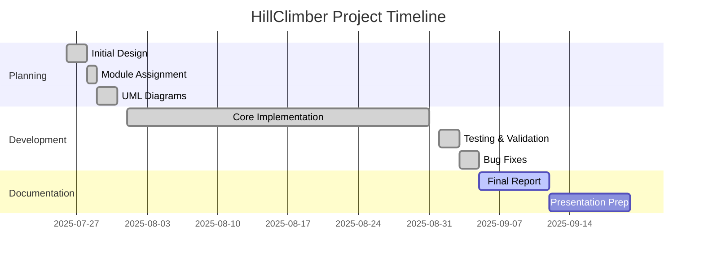

# 🚗 HillClimber - Malaysia Vehicle Rental System

Welcome to our **HillClimber** project - a comprehensive Vehicle Rental Service System developed as an Object-Oriented Programming (OOP) group assignment using Java!  
This production-ready system specializes in Malaysia's hill climbing vehicle rental market with full Malaysian localization and professional features.

## 📊 **Project Progress: 95% Complete** ✅

### **Current Status:**
- ✅ **Core Implementation**: 100% Complete
- ✅ **Testing & Debugging**: 90% Complete
- 🔄 **Final Documentation**: In Progress (5% remaining)
- 📅 **Deadline**: September 12, 2025 (7 days remaining)

## 👥 Group Members & Roles

- **Wei Lun** (Project Leader) - System Architecture & Integration
- **Oscar Lim** - Payment Module & Transaction Management
- **Wen Wei** - Customer Module & User Authentication
- **Guan Chen** - Vehicle Module & Inventory Management
- **Neeshwran** - Database Module & Data Persistence

## 🎯 **Implemented Features**

### ✅ **Core System Features**
- 🏔️ **Malaysian Hill Climbing Focus**: Specialized for Malaysia's terrain and regulations
- 👥 **Dual User System**: Customer portal + Manager administration panel
- 🚗 **Complete Rental Lifecycle**: Booking → Payment → Return → History
- 💳 **Multi-Payment Methods**: Credit Card, Online Banking, Cash payments
- ⏰ **Automated Duration Management**: Rental periods, reminders, and notifications
- 💾 **CSV Data Persistence**: Professional data storage with organized file structure

### ✅ **Malaysian Localization**
- 🆔 **IC Number Validation**: Malaysian IC format (XXXXXX-XX-XXXX) with age calculation
- 📱 **Phone Number Validation**: +60XXXXXXXXX or 0XXXXXXXXX formats
- 🚗 **License Type Validation**: B, B2, D, DA, E, E1, E2 categories
- 📍 **Address Validation**: Malaysian location support
- 🇲🇾 **Cultural Adaptation**: Malay language support and local business practices

### ✅ **Technical Architecture**
- 🏗️ **Modular Design**: 7 specialized modules (Customer, Vehicle, Payment, Rental, Duration, Database, Core)
- 🔒 **Input Validation**: Comprehensive validation for all user inputs with re-entry capability
- 📊 **Data Management**: 10+ DAO classes with CSV persistence
- 🎨 **OOP Principles**: Inheritance, Polymorphism, Encapsulation, Abstraction
- 🧪 **Error Handling**: Robust exception handling and user-friendly error messages

### ✅ **Vehicle Inventory** (70 vehicles)
- 🚵 **Mountain Bikes**: 20 units (RM45-RM80/day)
- 🏍️ **Dirt Bikes**: 20 units (RM50-RM90/day)
- 🚙 **Buggies**: 15 units (RM80-RM120/day)
- 🚗 **Crossovers**: 15 units (RM100-RM145/day)

## 📁 **Project Structure**

```
HillClimber/
├── src/hillclimmer/
│   ├── HillClimmer.java          # Main application class
│   ├── CustomerModule/           # Customer management & authentication
│   ├── VehicleModule/            # Vehicle inventory & types
│   ├── PaymentModule/            # Payment processing & transactions
│   ├── RentalModule/             # Rental booking & management
│   ├── DurationModule/           # Time management & reminders
│   └── DatabaseModule/           # Data persistence (10+ DAO classes)
├── data/                         # CSV data files
│   ├── customers.csv
│   ├── vehicles.csv
│   ├── payments.csv
│   ├── rentals.csv
│   ├── reminders.csv
│   └── rentalperiods.csv
├── build.xml                     # Apache Ant build configuration
└── README.md                     # Project documentation
```

## 🚀 **How to Run**

### Prerequisites
- Java 21 (JDK)
- NetBeans IDE (recommended) or any Java IDE

### Quick Start
1. **Open in NetBeans**: Import the `HillClimmer` project
2. **Compile**: Build the project to generate class files
3. **Run**: Execute `HillClimmer.java`
4. **Login Options**:
   - **Customer**: C001 / password123
   - **Manager**: VM001 / admin123

### Sample Usage
```bash
# Interactive Mode (Recommended)
java -cp src hillclimmer.HillClimmer

# Demo Mode (Automated showcase)
java -cp src hillclimmer.HillClimmer --demo
```

## 📋 **Deliverables Status**

### ✅ **Initial Stage** (Completed August 1, 2025)
- 📄 Cover page and project description
- 🧠 Detailed assignment concept with Malaysian focus
- 🗂️ Module assignments for each team member
- 🏗️ Complete UML class diagram with relationships

### 🔄 **Final Report** (Due September 12, 2025)
- 📄 Comprehensive amended report
- 🤝 Peer evaluation forms
- 🖼️ Screenshots and system demonstrations
- 💡 OOP principles documentation with code examples
- 🗃️ Complete Java source code and compiled classes
- 🏗️ Final enhanced UML diagrams

### 📊 **OOP Principles Implemented**
- **🏗️ Inheritance**: Vehicle hierarchy (MountainBike, DirtBike, Buggy, Crossover)
- **🔄 Polymorphism**: Payment methods (CreditCard, OnlineBanking, Cash)
- **🔒 Encapsulation**: Private fields with getter/setter methods
- **🎭 Abstraction**: Abstract Vehicle class and DAO interfaces
- **🔗 Association**: Customer-Rental-Payment relationships

## 🏷️ Topic

**HillClimber - Malaysia Hill Climbing Vehicle Rental System**

## 📅 **Project Timeline**



## 🎯 **Key Achievements**

- ✅ **Production-Ready Code**: Fully functional rental system
- ✅ **Malaysian Market Focus**: Localized for Malaysian users
- ✅ **Professional Architecture**: Clean OOP design with 7 modules
- ✅ **Comprehensive Testing**: Input validation and error handling
- ✅ **Data Persistence**: Organized CSV-based storage system
- ✅ **User Experience**: Intuitive interface with clear navigation

## 🗣️ **Presentation**

**Scheduled**: Week 13 & 14 (September 2025)
- 📊 System demonstration
- 🏗️ Architecture explanation
- 💡 OOP principles showcase
- �� Technical implementation details

---

**🎉 Project Status**: Ready for final submission and presentation!  
*Last updated: September 5, 2025*
